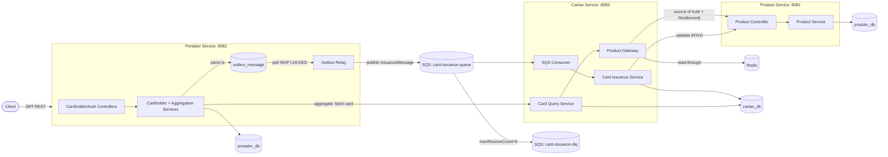
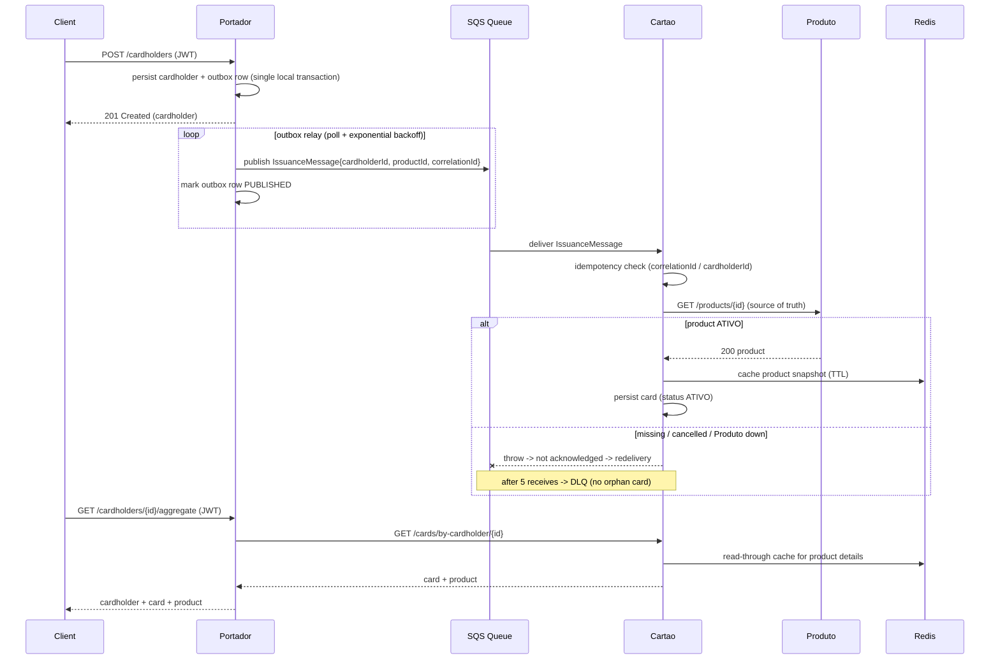

# Card Process

An ecosystem of three integrated Spring Boot microservices that manage the lifecycle of card
**Products**, **Cardholders** and **Cards**, issuing cards asynchronously through AWS SQS while
guaranteeing that a card is never created for a missing or cancelled product. The whole environment
(PostgreSQL, Redis, LocalStack, the three services) boots with a single command.

Built with **Java 21**, **Spring Boot 3.3**, PostgreSQL, Redis and AWS SQS (LocalStack), following
spec-driven development. The full specification, plan and task breakdown live under
[`specs/001-card-processing-ecosystem/`](specs/001-card-processing-ecosystem/).

## Table of contents

- [Architecture](#architecture)
- [Issuance flow](#issuance-flow)
- [How the system guarantees integrity](#how-the-system-guarantees-integrity)
- [Resilience](#resilience)
- [Technical decisions](#technical-decisions)
- [Setup](#setup)
- [API reference](#api-reference)
- [Testing](#testing)
- [Project structure](#project-structure)

## Architecture



| Service | Port | Role | Owns |
|---------|------|------|------|
| **Produto** | 8081 | Product catalog (source of truth for products) | `produto_db` |
| **Portador** | 8082 | Cardholder orchestrator, JWT auth, issuance trigger, aggregated view | `portador_db` |
| **Cartao** | 8083 | Card issuance core, SQS consumer, Redis-cached product integration | `cartao_db` |

Each service is internally layered as `web -> application -> domain -> infrastructure`, with
dependencies pointing inward. Cross-boundary payloads (the SQS `IssuanceMessage`) live in a thin
`shared-contracts` module so producer and consumer never drift.

## Issuance flow



## How the system guarantees integrity

**A card is never created for a non-existent or cancelled product.** This is enforced on the
*write* path, not the cache:

1. When the Cartao Service consumes an `IssuanceMessage`, it calls the Produto Service **source of
   truth** (`GET /products/{id}`) — never the cache — to authorize the write.
2. A missing product (`404`) raises `ProductNotFoundException`; a non-`ATIVO` product raises
   `ProductNotActiveException`. In both cases **no card is persisted**.
3. Because the listener throws, the SQS message is **not acknowledged**, becomes visible again after
   the visibility timeout, and after `maxReceiveCount = 5` is moved to the **Dead Letter Queue** by
   SQS itself. The poison message is captured; the database stays clean.
4. Redelivery is safe: the card table has unique constraints on `correlation_id` and
   `cardholder_id`, and the consumer checks for an existing card before inserting, so a
   redelivered message can never create a duplicate card (idempotent consumption).

**A card is never issued for a cardholder that was not committed.** Registration uses a
**transactional outbox**: the cardholder row and the `IssuanceMessage` (serialized into
`outbox_message`) commit in the *same* local transaction — there is no dual write to the database
and the broker. A scheduled relay drains the table with `FOR UPDATE SKIP LOCKED` and publishes to
SQS with **at-least-once** semantics; a crash between publish and mark-as-published only causes a
duplicate delivery, which the consumer's idempotency (rule 4) absorbs. If the transaction rolls
back, the outbox row rolls back with it, so no message can ever exist for a cardholder that does
not.

The cache is a **read accelerator only** — it is consulted for enrichment/aggregation reads, never
to authorize a write. This separation (fail-closed writes, fail-open reads) is the core of the
data-integrity guarantee.

## Resilience

Designed for "systems that cannot stop". Behavior under failure:

| Failure | Behavior |
|---------|----------|
| **SQS unavailable when registering** | Registration commits the cardholder **and** the issuance intent (outbox row) in one local transaction and still returns `201`. The outbox relay keeps retrying with exponential backoff and delivers as soon as SQS recovers — no registration is rejected and no issuance is lost. |
| **Produto Service offline during issuance** | `ProductGateway.requireActiveProduct` fails closed; the message is retried with backoff and ultimately dead-lettered. **Zero orphan cards.** |
| **Produto Service unstable** | The synchronous client is wrapped with Resilience4j: connect/read timeouts, retry with exponential backoff, and a circuit breaker that sheds load from the failing dependency. |
| **Redis down** | `RedisProductCache` swallows the failure and degrades to a cache miss; the gateway falls back to a direct (resilient) Produto call. Reads still succeed — no `500`. |
| **Redis down AND Produto unstable (reads)** | Enrichment degrades gracefully: the card is still returned with `product = null` rather than failing, so the cardholder is never left without a response. |
| **Cartao Service offline during aggregate** | The Portador -> Cartao client is wrapped with Resilience4j (timeouts, retry with backoff, circuit breaker) and surfaces a semantic `503` problem detail instead of hanging or returning `500`. |
| **Concurrent duplicate registration (CPF/username)** | A losing race trips the unique constraint and rolls back the whole transaction — cardholder and outbox row together, so no issuance message survives for a rolled-back cardholder; the violation is mapped to `409 Conflict`. |
| **Any unhandled domain error** | Every handler extends `ResponseEntityExceptionHandler` plus a logged catch-all, so framework and unexpected errors alike return an RFC 7807 `application/problem+json` body — never a raw stack trace. |
| **Container crash** | All containers run with `restart: unless-stopped`, so a crashed service rejoins the mesh automatically. |

## Technical decisions

Full rationale (with rejected alternatives) is in
[`specs/.../research.md`](specs/001-card-processing-ecosystem/research.md). Highlights:

- **Transactional outbox** for issuance publishing: the cardholder insert and the issuance message
  commit atomically in `portador_db`, closing the classic dual-write gap between the database and
  the broker. A scheduled relay drains the table in `FOR UPDATE SKIP LOCKED` batches (safe for
  multiple instances) and publishes with exponential backoff; delivery is at-least-once and the
  consumer's idempotency absorbs duplicates. The SQS transport resolves the queue URL via
  `SqsAsyncClient` with a success-only cache, because `SqsTemplate` caches a *failed* queue
  resolution forever and would leave the relay permanently broken after an outage.
- **SQS-native retry + DLQ redrive** instead of in-memory retries: broker-side redrive survives
  consumer crashes and guarantees poison messages reach the DLQ — the financial-grade standard.
- **Read-through Redis cache with TTL** behind a `ProductCache` interface: transparent to callers,
  bounds staleness, and lets the gateway fall back to direct calls when the cache is unavailable.
  A type-safe `Jackson2JsonRedisSerializer<ProductSnapshot>` keeps cached payloads compact and
  decoupled from Java serialization.
- **Source-of-truth validation for writes**: the cache may serve reads, but card creation always
  confirms the product against the Produto Service, closing the orphan-card gap.
- **Resilience4j** (timeouts + retry + circuit breaker) on the only synchronous inter-service call,
  the dependency the brief explicitly asks us to harden.
- **Database-per-service** with **Flyway** migrations and **JPA auditing** (`createdAt`/`updatedAt`):
  reproducible schemas and declarative auditing for every entity.
- **Stateless JWT** (HS256) for Portador authentication — no shared session store.
- **Multi-module Maven monorepo** with multi-stage Dockerfiles: one build, reproducible images,
  no host toolchain required, single-command boot.

## Setup

### Prerequisites

- Docker + Docker Compose (the only hard requirement to run the ecosystem).
- Optional for local development and tests: Java 21 and Maven 3.9+.

### Run everything (single command)

```bash
docker compose up --build
```

This builds the three service images (Maven runs inside each build stage) and starts PostgreSQL,
Redis, LocalStack (which auto-provisions the queue + DLQ) and the three services. Health checks gate
startup ordering, so the stack is ready when all containers report healthy.

| Service | Base URL | Swagger UI |
|---------|----------|------------|
| Produto | http://localhost:8081 | http://localhost:8081/swagger-ui.html |
| Portador | http://localhost:8082 | http://localhost:8082/swagger-ui.html |
| Cartao | http://localhost:8083 | http://localhost:8083/swagger-ui.html |

### End-to-end demo

```bash
# 1. Create a product
PRODUCT_ID=$(curl -s -X POST http://localhost:8081/products \
  -H 'Content-Type: application/json' -d '{"name":"Black"}' | jq -r .id)

# 2. Register an operator and log in
curl -s -X POST http://localhost:8082/auth/register \
  -H 'Content-Type: application/json' -d '{"username":"operator","password":"secret123"}'
TOKEN=$(curl -s -X POST http://localhost:8082/auth/login \
  -H 'Content-Type: application/json' -d '{"username":"operator","password":"secret123"}' | jq -r .token)

# 3. Register a cardholder -> triggers async issuance
CARDHOLDER_ID=$(curl -s -X POST http://localhost:8082/cardholders \
  -H "Authorization: Bearer $TOKEN" -H 'Content-Type: application/json' \
  -d "{\"name\":\"Maria Silva\",\"cpf\":\"39053344705\",\"birthDate\":\"1990-05-12\",\"productId\":\"$PRODUCT_ID\"}" | jq -r .id)

# 4. Query the aggregated view (cardholder + card + product)
curl -s -H "Authorization: Bearer $TOKEN" \
  http://localhost:8082/cardholders/$CARDHOLDER_ID/aggregate | jq
```

A ready-to-import **Postman collection** is provided at
[`postman_collection.json`](postman_collection.json) (captures the product id, token and cardholder
id automatically and includes resilience probes).

### Failure demos

```bash
# Redis down -> reads still succeed via direct Produto calls
docker compose stop redis
curl -s http://localhost:8083/cards/by-cardholder/$CARDHOLDER_ID | jq
docker compose start redis

# SQS down -> registration still succeeds; the outbox delivers when SQS returns
docker compose stop localstack
# register another cardholder: it returns 201 and the message waits in portador's outbox_message table
docker compose start localstack
# within seconds the relay publishes the pending row and the card is issued

# Produto offline -> no orphan card; message lands in the DLQ
docker compose stop produto-service
# register another cardholder, then inspect the DLQ depth:
docker compose exec localstack awslocal sqs get-queue-attributes \
  --queue-url http://localhost:4566/000000000000/card-issuance-dlq \
  --attribute-names ApproximateNumberOfMessages
docker compose start produto-service
```

## API reference

OpenAPI/Swagger UI is exposed per service (links above). Contract files are also versioned under
[`specs/.../contracts/`](specs/001-card-processing-ecosystem/contracts/).

| Method | Endpoint | Service | Auth | Description |
|--------|----------|---------|------|-------------|
| POST | `/products` | Produto | - | Create a product |
| GET | `/products/{id}` | Produto | - | Get a product |
| PATCH | `/products/{id}/cancel` | Produto | - | Cancel a product |
| POST | `/auth/register` | Portador | - | Register an operator |
| POST | `/auth/login` | Portador | - | Obtain a JWT |
| POST | `/cardholders` | Portador | JWT | Register a cardholder, trigger issuance |
| GET | `/cardholders/{id}` | Portador | JWT | Get a cardholder |
| GET | `/cardholders/{id}/aggregate` | Portador | JWT | Cardholder + card + product |
| GET | `/cards/{id}` | Cartao | - | Get a card (product via cache) |
| GET | `/cards/by-cardholder/{cardholderId}` | Cartao | - | Get a cardholder's card |
| PATCH | `/cards/{id}/status` | Cartao | - | Update card status |

## Testing

```bash
mvn test
```

Runs unit tests (business rules in isolation) and integration tests backed by **Testcontainers**
(real PostgreSQL, Redis, LocalStack SQS) plus WireMock for the Produto integration. The critical
flows are covered:

- **Registration -> enqueue**: `CardholderIssuanceIntegrationTest` (real Postgres + SQS).
- **Outbox survives an SQS outage**: `OutboxDeliveryIntegrationTest` registers a cardholder while
  the queue does not exist (registration still returns `201`, the outbox row stays `PENDING` and
  accumulates retry attempts), then creates the queue and proves the relay delivers the message
  and marks the row `PUBLISHED`.
- **Consume -> validate -> persist + cache**: `CardConsumptionIntegrationTest` (real Postgres +
  Redis + SQS, WireMock Produto) — also asserts the product is fetched once and reads are cache hits,
  and that no card is created for a non-existent product.

Docker must be running for the integration tests. The surefire configuration pins the Docker API
version (`1.41`) so Testcontainers works with engines that require a modern API (e.g. OrbStack).

## Project structure

```text
.
├── docker-compose.yml          # Postgres, Redis, LocalStack, 3 services (single-command boot)
├── pom.xml                     # Aggregator / dependency management
├── shared-contracts/           # Cross-service wire contract (IssuanceMessage)
├── produto-service/            # Product catalog
├── portador-service/           # Cardholder orchestrator (JWT, SQS producer, aggregation)
├── cartao-service/             # Issuance core (SQS consumer, Redis cache, Resilience4j)
├── infra/                      # Postgres + LocalStack init scripts
├── postman_collection.json     # Importable API collection
├── IMPLEMENTATION.md           # How this was built, step by step (English)
├── docs/                       # RELATORIO-DE-IMPLEMENTACAO.md, RELATORIO-DE-HARDENING.md (PT) + questionnaire answers
└── specs/001-card-processing-ecosystem/   # spec-kit artifacts (spec, plan, research, tasks, contracts)
```
