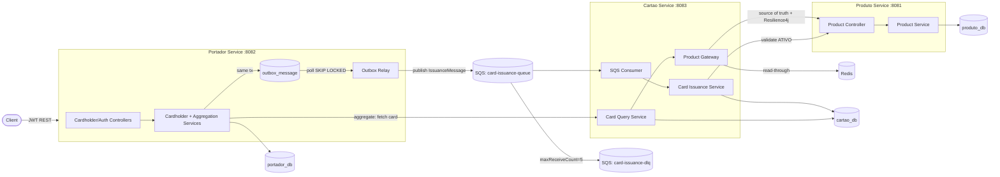
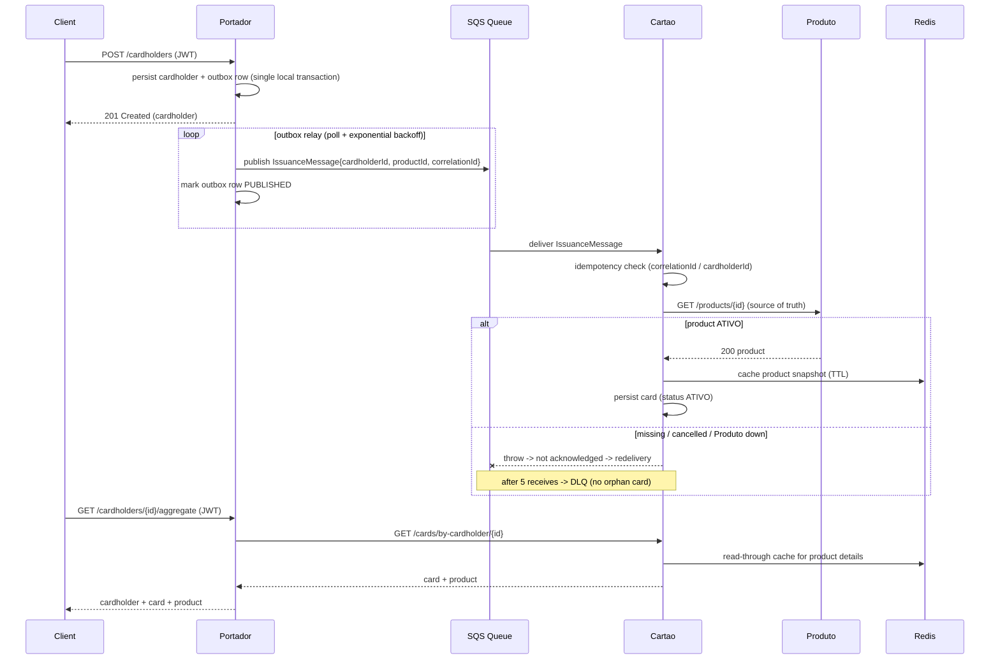

# Card Process

*[English](README.md)*

Um ecossistema de três microsserviços Spring Boot integrados que gerenciam o ciclo de vida de
**Produtos**, **Portadores** e **Cartões**, emitindo cartões de forma assíncrona via AWS SQS,
garantindo que um cartão nunca seja criado para um produto ausente ou cancelado. Todo o ambiente
(PostgreSQL, Redis, LocalStack, os três serviços) sobe com um único comando.

Construído com **Java 21**, **Spring Boot 3.3**, PostgreSQL, Redis e AWS SQS (LocalStack), seguindo
desenvolvimento orientado a especificação. A especificação completa, o plano e a divisão em tarefas
estão em [`specs/001-card-processing-ecosystem/`](specs/001-card-processing-ecosystem/).

## Sumário

- [Arquitetura](#arquitetura)
- [Fluxo de emissão](#fluxo-de-emissão)
- [Como o sistema garante integridade](#como-o-sistema-garante-integridade)
- [Resiliência](#resiliência)
- [Decisões técnicas](#decisões-técnicas)
- [Setup](#setup)
- [Referência de API](#referência-de-api)
- [Testes](#testes)
- [Estrutura do projeto](#estrutura-do-projeto)

## Arquitetura



| Serviço | Porta | Papel | Dono |
|---------|------|------|------|
| **Produto** | 8081 | Catálogo de produtos (fonte da verdade para produtos) | `produto_db` |
| **Portador** | 8082 | Orquestrador de portadores, auth JWT, gatilho de emissão, visão agregada | `portador_db` |
| **Cartao** | 8083 | Núcleo de emissão de cartões, consumidor SQS, integração de produto via cache Redis | `cartao_db` |

Cada serviço é organizado internamente em camadas `web -> application -> domain -> infrastructure`,
com dependências apontando para dentro. Payloads que cruzam a fronteira entre serviços (o
`IssuanceMessage` da SQS) vivem num módulo fino `shared-contracts`, para que produtor e consumidor
nunca divirjam.

## Fluxo de emissão



## Como o sistema garante integridade

**Um cartão nunca é criado para um produto inexistente ou cancelado.** Isso é garantido no
caminho de *escrita*, não no cache:

1. Quando o Cartao Service consome um `IssuanceMessage`, ele chama a **fonte da verdade** do
   Produto Service (`GET /products/{id}`) — nunca o cache — para autorizar a escrita.
2. Um produto ausente (`404`) levanta `ProductNotFoundException`; um produto não-`ATIVO` levanta
   `ProductNotActiveException`. Em ambos os casos **nenhum cartão é persistido**.
3. Como o listener lança exceção, a mensagem SQS **não é confirmada**, volta a ficar visível após
   o visibility timeout, e após `maxReceiveCount = 5` é movida para a **Dead Letter Queue** pela
   própria SQS. A mensagem envenenada é capturada; o banco continua limpo.
4. A reentrega é segura: a tabela de cartões tem constraints únicas em `correlation_id` e
   `cardholder_id`, e o consumidor checa se já existe um cartão antes de inserir, então uma
   mensagem reentregue nunca pode criar um cartão duplicado (consumo idempotente).

**Um cartão nunca é emitido para um portador que não foi commitado.** O cadastro usa um
**outbox transacional**: a linha do portador e o `IssuanceMessage` (serializado em
`outbox_message`) commitam na *mesma* transação local — não há dual write entre o banco e o
broker. Um relay agendado drena a tabela com `FOR UPDATE SKIP LOCKED` e publica na SQS com
semântica **at-least-once**; um crash entre a publicação e a marcação como publicado só causa uma
entrega duplicada, que a idempotência do consumidor (regra 4) absorve. Se a transação sofrer
rollback, a linha do outbox sofre rollback junto, então nenhuma mensagem pode existir para um
portador que não existe.

O cache é **apenas um acelerador de leitura** — é consultado para leituras de
enriquecimento/agregação, nunca para autorizar uma escrita. Essa separação (escritas fail-closed,
leituras fail-open) é o núcleo da garantia de integridade de dados.

## Resiliência

Projetado para "sistemas que não podem parar". Comportamento sob falha:

| Falha | Comportamento |
|---------|----------|
| **SQS indisponível no cadastro** | O cadastro commita o portador **e** a intenção de emissão (linha do outbox) numa única transação local e ainda retorna `201`. O relay do outbox continua tentando com backoff exponencial e entrega assim que a SQS se recupera — nenhum cadastro é rejeitado e nenhuma emissão é perdida. |
| **Produto Service offline durante a emissão** | `ProductGateway.requireActiveProduct` falha fechado; a mensagem é reprocessada com backoff e, no limite, vai para a dead letter. **Zero cartões órfãos.** |
| **Produto Service instável** | O cliente síncrono é envolvido com Resilience4j: timeouts de conexão/leitura, retry com backoff exponencial e um circuit breaker que alivia a carga da dependência com falha. |
| **Redis fora do ar** | `RedisProductCache` engole a falha e degrada para um cache miss; o gateway cai para uma chamada direta (resiliente) ao Produto. As leituras continuam funcionando — sem `500`. |
| **Redis fora do ar E Produto instável (leituras)** | O enriquecimento degrada graciosamente: o cartão ainda é retornado com `product = null` em vez de falhar, então o portador nunca fica sem resposta. |
| **Cartao Service offline durante o aggregate** | O cliente Portador -> Cartao é envolvido com Resilience4j (timeouts, retry com backoff, circuit breaker) e retorna um problem detail semântico `503` em vez de travar ou retornar `500`. |
| **Cadastro concorrente duplicado (CPF/username)** | A requisição perdedora da corrida viola a constraint única e sofre rollback da transação inteira — portador e linha do outbox juntos, então nenhuma mensagem de emissão sobrevive para um portador com rollback; a violação é mapeada para `409 Conflict`. |
| **Qualquer erro de domínio não tratado** | Todo handler estende `ResponseEntityExceptionHandler` mais um catch-all logado, então erros do framework e inesperados igualmente retornam um corpo RFC 7807 `application/problem+json` — nunca um stack trace bruto. |
| **Crash de container** | Todos os containers rodam com `restart: unless-stopped`, então um serviço que cai volta a se juntar à malha automaticamente. |

## Decisões técnicas

A justificativa completa (com alternativas rejeitadas) está em
[`specs/.../research.md`](specs/001-card-processing-ecosystem/research.md). Destaques:

- **Outbox transacional** para a publicação de emissão: o insert do portador e a mensagem de
  emissão commitam atomicamente no `portador_db`, fechando a clássica lacuna de dual-write entre o
  banco e o broker. Um relay agendado drena a tabela em lotes `FOR UPDATE SKIP LOCKED` (seguro para
  múltiplas instâncias) e publica com backoff exponencial; a entrega é at-least-once e a
  idempotência do consumidor absorve duplicatas. O transporte SQS resolve a URL da fila via
  `SqsAsyncClient` com um cache que só armazena sucessos, porque o `SqsTemplate` armazena uma
  resolução de fila *falha* para sempre e deixaria o relay permanentemente quebrado após uma
  indisponibilidade.
- **Retry nativo da SQS + redrive para DLQ** em vez de retries em memória: o redrive do lado do
  broker sobrevive a crashes do consumidor e garante que mensagens envenenadas cheguem à DLQ — o
  padrão de nível financeiro.
- **Cache Redis read-through com TTL** por trás de uma interface `ProductCache`: transparente para
  quem chama, limita a obsolescência dos dados, e permite que o gateway caia para chamadas diretas
  quando o cache está indisponível. Um `Jackson2JsonRedisSerializer<ProductSnapshot>` type-safe
  mantém os payloads em cache compactos e desacoplados da serialização nativa do Java.
- **Validação contra a fonte da verdade nas escritas**: o cache pode servir leituras, mas a
  criação de cartão sempre confirma o produto contra o Produto Service, fechando a lacuna de
  cartão órfão.
- **Resilience4j** (timeouts + retry + circuit breaker) na única chamada síncrona entre serviços,
  a dependência que o briefing pede explicitamente para blindar.
- **Banco de dados por serviço** com migrações **Flyway** e auditoria **JPA**
  (`createdAt`/`updatedAt`): schemas reproduzíveis e auditoria declarativa para cada entidade.
- **JWT stateless** (HS256) para autenticação do Portador — sem armazenamento de sessão
  compartilhado.
- **Monorepo Maven multi-módulo** com Dockerfiles multi-stage: um único build, imagens
  reproduzíveis, sem necessidade de toolchain no host, boot com um único comando.

## Setup

### Pré-requisitos

- Docker + Docker Compose (o único requisito obrigatório para rodar o ecossistema).
- Opcional para desenvolvimento local e testes: Java 21 (o Maven vem pelo wrapper `./mvnw`).

### Rodar tudo (um único comando)

```bash
docker compose up --build
```

Isso faz o build das três imagens dos serviços (o Maven roda dentro de cada estágio de build) e
sobe PostgreSQL, Redis, LocalStack (que auto-provisiona a fila + DLQ) e os três serviços. Health
checks controlam a ordem de subida, então a stack fica pronta quando todos os containers reportam
saudáveis.

| Serviço | URL base | Swagger UI |
|---------|----------|------------|
| Produto | http://localhost:8081 | http://localhost:8081/swagger-ui.html |
| Portador | http://localhost:8082 | http://localhost:8082/swagger-ui.html |
| Cartao | http://localhost:8083 | http://localhost:8083/swagger-ui.html |

### Demo ponta a ponta

```bash
# 1. Criar um produto
PRODUCT_ID=$(curl -s -X POST http://localhost:8081/products \
  -H 'Content-Type: application/json' -d '{"name":"Black"}' | jq -r .id)

# 2. Registrar um operador e fazer login
curl -s -X POST http://localhost:8082/auth/register \
  -H 'Content-Type: application/json' -d '{"username":"operator","password":"secret123"}'
TOKEN=$(curl -s -X POST http://localhost:8082/auth/login \
  -H 'Content-Type: application/json' -d '{"username":"operator","password":"secret123"}' | jq -r .token)

# 3. Registrar um portador -> dispara emissão assíncrona
CARDHOLDER_ID=$(curl -s -X POST http://localhost:8082/cardholders \
  -H "Authorization: Bearer $TOKEN" -H 'Content-Type: application/json' \
  -d "{\"name\":\"Maria Silva\",\"cpf\":\"39053344705\",\"birthDate\":\"1990-05-12\",\"productId\":\"$PRODUCT_ID\"}" | jq -r .id)

# 4. Consultar a visão agregada (portador + cartão + produto)
curl -s -H "Authorization: Bearer $TOKEN" \
  http://localhost:8082/cardholders/$CARDHOLDER_ID/aggregate | jq
```

Uma **coleção Postman** pronta para importar está disponível em
[`postman_collection.json`](postman_collection.json) (captura o id do produto, o token e o id do
portador automaticamente e inclui sondas de resiliência).

### Demos de falha

```bash
# Redis fora do ar -> leituras continuam funcionando via chamadas diretas ao Produto
docker compose stop redis
curl -s http://localhost:8083/cards/by-cardholder/$CARDHOLDER_ID | jq
docker compose start redis

# SQS fora do ar -> cadastro continua funcionando; o outbox entrega quando a SQS volta
docker compose stop localstack
# registre outro portador: retorna 201 e a mensagem espera na tabela outbox_message do portador
docker compose start localstack
# em poucos segundos o relay publica a linha pendente e o cartão é emitido

# Produto offline -> nenhum cartão órfão; mensagem vai para a DLQ
docker compose stop produto-service
# registre outro portador, depois inspecione a profundidade da DLQ:
docker compose exec localstack awslocal sqs get-queue-attributes \
  --queue-url http://localhost:4566/000000000000/card-issuance-dlq \
  --attribute-names ApproximateNumberOfMessages
docker compose start produto-service
```

### Deploy em produção (VPS + Coolify)

Uma variante da stack pronta para produção está em
[`docker-compose.prod.yml`](docker-compose.prod.yml): o LocalStack é substituído pelo
[ElasticMQ](https://github.com/softwaremill/elasticmq) (mesmo protocolo SQS, filas persistentes,
redrive declarativo para DLQ), os segredos são obrigatórios, os serviços de infra ficam apenas na
rede interna, e um sidecar faz backup diário do Postgres. O runbook completo — VPS única
gerenciada pelo [Coolify](https://coolify.io), TLS via Traefik/Let's Encrypt, deploys por git push
— está em [`docs/guides/deploy-vps-coolify.pt.md`](docs/guides/deploy-vps-coolify.pt.md).

## Referência de API

OpenAPI/Swagger UI é exposto por serviço (links acima). Os arquivos de contrato também são
versionados em [`specs/.../contracts/`](specs/001-card-processing-ecosystem/contracts/).

| Método | Endpoint | Serviço | Auth | Descrição |
|--------|----------|---------|------|-------------|
| POST | `/products` | Produto | - | Criar um produto |
| GET | `/products/{id}` | Produto | - | Buscar um produto |
| PATCH | `/products/{id}/cancel` | Produto | - | Cancelar um produto |
| POST | `/auth/register` | Portador | - | Registrar um operador |
| POST | `/auth/login` | Portador | - | Obter um JWT |
| POST | `/cardholders` | Portador | JWT | Registrar um portador, disparar emissão |
| GET | `/cardholders/{id}` | Portador | JWT | Buscar um portador |
| GET | `/cardholders/{id}/aggregate` | Portador | JWT | Portador + cartão + produto |
| GET | `/cards/{id}` | Cartao | - | Buscar um cartão (produto via cache) |
| GET | `/cards/by-cardholder/{cardholderId}` | Cartao | - | Buscar o cartão de um portador |
| PATCH | `/cards/{id}/status` | Cartao | - | Atualizar o status de um cartão |

## Testes

```bash
./mvnw test
```

Roda testes unitários (regras de negócio isoladas) e testes de integração apoiados em
**Testcontainers** (PostgreSQL, Redis, LocalStack SQS reais) mais WireMock para a integração com o
Produto. Os fluxos críticos estão cobertos:

- **Cadastro -> enfileiramento**: `CardholderIssuanceIntegrationTest` (Postgres + SQS reais).
- **Outbox sobrevive a uma indisponibilidade da SQS**: `OutboxDeliveryIntegrationTest` registra um
  portador enquanto a fila não existe (o cadastro ainda retorna `201`, a linha do outbox continua
  `PENDING` e acumula tentativas), depois cria a fila e prova que o relay entrega a mensagem e
  marca a linha como `PUBLISHED`.
- **Consumir -> validar -> persistir + cache**: `CardConsumptionIntegrationTest` (Postgres + Redis
  + SQS reais, WireMock Produto) — também verifica que o produto é buscado uma única vez e que as
  leituras batem no cache, e que nenhum cartão é criado para um produto inexistente.

O Docker precisa estar rodando para os testes de integração. A configuração do surefire fixa a
versão da API Docker (`1.41`) para que o Testcontainers funcione com engines que exigem uma API
mais moderna (ex.: OrbStack).

## Estrutura do projeto

```text
.
├── docker-compose.yml          # Postgres, Redis, LocalStack, 3 serviços (boot com um comando)
├── pom.xml                     # Agregador / gestão de dependências
├── shared-contracts/           # Contrato compartilhado entre serviços (IssuanceMessage)
├── produto-service/            # Catálogo de produtos
├── portador-service/           # Orquestrador de portadores (JWT, produtor SQS, agregação)
├── cartao-service/             # Núcleo de emissão (consumidor SQS, cache Redis, Resilience4j)
├── infra/                      # Scripts de init do Postgres + LocalStack
├── postman_collection.json     # Coleção de API importável
├── docs/                       # Veja docs/README.pt.md para o índice completo
│   ├── guides/                 # Setup de dev local, runbook de deploy VPS/Coolify, guia do spec-kit (EN + PT)
│   └── reports/                # Relato da implementação + relatório de hardening (EN + PT)
└── specs/001-card-processing-ecosystem/   # Artefatos do spec-kit (spec, plan, research, tasks, contracts)
```
